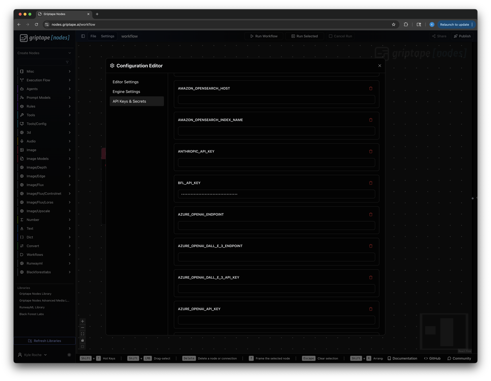
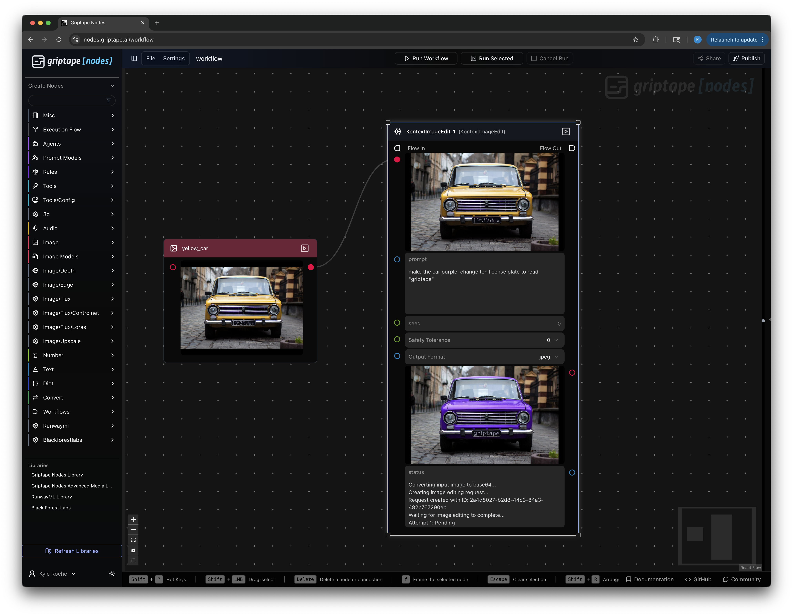

# Black Forest Labs Nodes for Griptape

This library provides Griptape Nodes for interacting with Black Forest Labs' FLUX APIs, enabling high-quality image generation and editing capabilities directly within your Griptape workflows.

## Features

- **FLUX Text-to-Image**: Generate images using FLUX Pro, Dev, and Ultra models
- **FLUX.1 Kontext Text-to-Image**: Generate high-quality images from text prompts with Kontext models
- **FLUX.1 Kontext Image Editing**: Edit existing images with text instructions, including:
  - Object modifications (colors, shapes, elements)
  - Text editing within images
  - Smart, natural-looking changes
  - Iterative editing with character consistency

## Installation

1. Clone this repository into your Griptape Nodes workspace directory:

```bash
# Navigate to your workspace directory
cd $(gtn config | grep workspace_directory | cut -d'"' -f4)

# Clone the repository
git clone https://github.com/griptape-ai/griptape-nodes-library-blackforestlabs.git
```

2. Install dependencies:

```bash
cd griptape-nodes-library-blackforestlabs
uv sync
```

## API Key Setup

You'll need a Black Forest Labs API key to use these nodes.

### Get Your API Key

1. Visit [Black Forest Labs Documentation](https://docs.bfl.ml/) 
2. Create an account and navigate to your API settings
3. Generate a new API key

### Configure Your API Key

Set your API key as an environment variable:

```bash
export BFL_API_KEY="your_api_key_here"
```

Or configure it through the Griptape Nodes UI:



## Available Nodes

### FLUX Text-to-Image

Generate high-quality images using general FLUX models with advanced control options:

- **Model**: Choose from:
  - `flux-pro-1.1-ultra` (highest quality)
  - `flux-pro-1.1` (balanced, default)
  - `flux-pro` (standard)
  - `flux-dev` (open-source)
- **Prompt**: Text description of the desired image
- **Aspect Ratio**: Wide range from 21:9 to 9:21 (ultra-wide to tall formats)
- **Seed**: For reproducible generation
- **Raw Mode**: Generate less processed, more natural-looking images
- **Safety Tolerance**: Content moderation level (1-6)
- **Output Format**: JPEG or PNG

### FLUX.1 Kontext Text-to-Image

Generate images from text descriptions using specialized Kontext models:

- **Model**: Choose between:
  - `flux-kontext-pro` (faster generation, default)
  - `flux-kontext-max` (higher quality)
- **Prompt**: Text description of the desired image
- **Aspect Ratio**: Choose from 3:7 to 7:3 ratios (supports portrait, landscape, square)
- **Seed**: For reproducible generation
- **Prompt Upsampling**: Enhanced prompt processing
- **Safety Tolerance**: Content moderation level (0-2)
- **Output Format**: JPEG or PNG

### FLUX.1 Kontext Image Edit

Modify existing images using text instructions with Kontext models:

- **Model**: Choose between `flux-kontext-pro` or `flux-kontext-max`
- **Input Image**: Accepts both ImageArtifact and ImageUrlArtifact
- **Prompt**: Edit instructions (use quotes for text replacement: `Replace '[old text]' with '[new text]'`)
- **Aspect Ratio**: Choose from 3:7 to 7:3 ratios
- **Seed**: For reproducible edits
- **Prompt Upsampling**: Enhanced prompt processing
- **Safety Tolerance**: Content moderation level (0-6, wider range than text-to-image)
- **Output Format**: JPEG or PNG

## Model Comparison

### When to Use FLUX vs Kontext

**Use FLUX Text-to-Image for:**
- Traditional text-to-image generation
- Ultra-high quality with FLUX Pro Ultra
- Open-source workflows with FLUX Dev
- Wide aspect ratios (21:9 to 9:21)
- Raw, natural-looking images

**Use FLUX.1 Kontext for:**
- Advanced image editing workflows
- Iterative editing with consistency
- Text replacement in images
- Character preservation across edits

## Example Workflows

### Basic Image Generation

1. Add a **FLUX Text-to-Image** node
2. Choose your model (flux-pro-1.1 for balanced quality/speed)
3. Set your prompt: `"A small furry elephant pet looks out from a cat house"`
4. Choose your aspect ratio (default: 1:1)
5. Run the workflow
6. The generated image will be available as an ImageArtifact output

### High-Quality Generation

1. Use **FLUX Text-to-Image** with `flux-pro-1.1-ultra` model
2. Enable **Raw Mode** for natural-looking results
3. Use wide aspect ratios for cinematic shots

### Image Editing Pipeline



1. **Generate Base Image**: Use FLUX.1 Kontext Text-to-Image to create your starting image
2. **Edit the Image**: Connect the output to FLUX.1 Kontext Image Edit node
3. **Add Edit Instructions**: 
   - Object changes: `"Change the car color to red"`
   - Text replacement: `Replace 'Hello' with 'Welcome'`
   - Style changes: `"Make it look like a painting"`

### Text Editing in Images

For precise text editing, use the quote syntax with Kontext Image Edit:

```
Replace 'Choose joy' with 'FLUX Rocks'
```

This works particularly well for:
- Signs and posters
- Labels and captions
- Brand text replacement

## Advanced Features

### Iterative Editing

FLUX.1 Kontext excels at maintaining consistency across multiple edits. You can chain multiple Image Edit nodes to make progressive changes while preserving character and scene consistency.

### Reproducible Results

Use the `seed` parameter to generate consistent results:
- Same prompt + same seed = same image
- Useful for A/B testing different prompts
- Essential for collaborative workflows

### Safety Controls

All nodes include safety tolerance settings:
- **FLUX Text-to-Image**: 1-6 (2 = default)
- **FLUX.1 Kontext Text-to-Image**: 0-2 (2 = least restrictive)
- **FLUX.1 Kontext Image Edit**: 0-6 (6 = least restrictive)

Higher values allow more creative freedom but may generate content that requires review.

## API Documentation

For detailed API information and advanced usage:

- [Black Forest Labs API Documentation](https://docs.bfl.ml/quick_start/generating_images)
- [FLUX.1 Kontext Text-to-Image Documentation](https://docs.bfl.ml/kontext/kontext_text_to_image)
- [FLUX.1 Kontext Image Editing Documentation](https://docs.bfl.ml/kontext/kontext_image_editing)
- [Black Forest Labs API Reference](https://docs.bfl.ml/)

## Troubleshooting

### Common Issues

**"API key not found"**
- Ensure `BFL_API_KEY` environment variable is set
- Check the API key is valid and active

**"404 Not Found"**
- Verify you're using the latest version of the library
- Check your internet connection

**"Generation failed with status 'Pending'"**
- This should resolve automatically - the node polls until completion
- Large images or complex edits may take longer

**Image connection errors**
- Image Edit node accepts both ImageArtifact and ImageUrlArtifact
- Ensure the input image is properly connected

### Getting Help

If you encounter issues:

1. Check the [Black Forest Labs Documentation](https://docs.bfl.ml/)
2. Verify your API key and account status
3. Review the node's status output for detailed error messages

## License

This project is licensed under the Apache License 2.0 - see the [LICENSE](LICENSE) file for details.

## Contributing

Contributions are welcome! Please feel free to submit a Pull Request.
